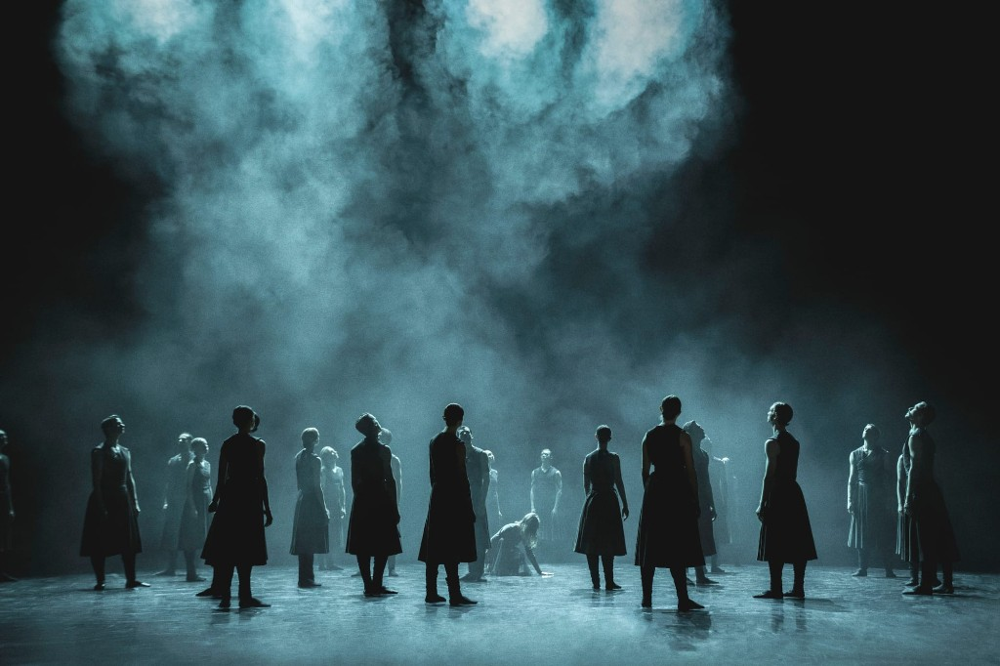
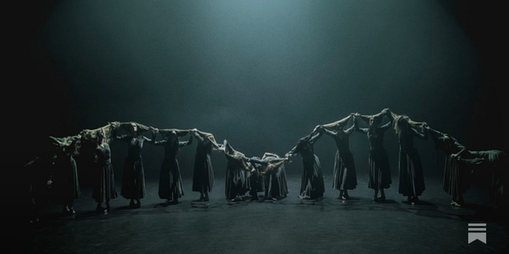
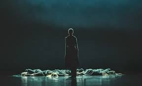
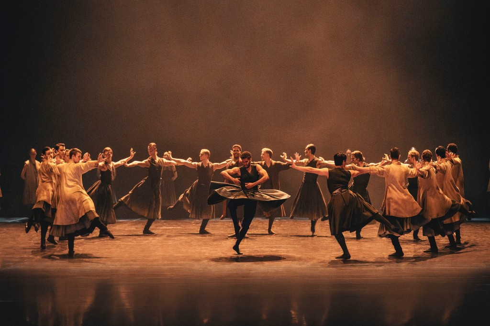
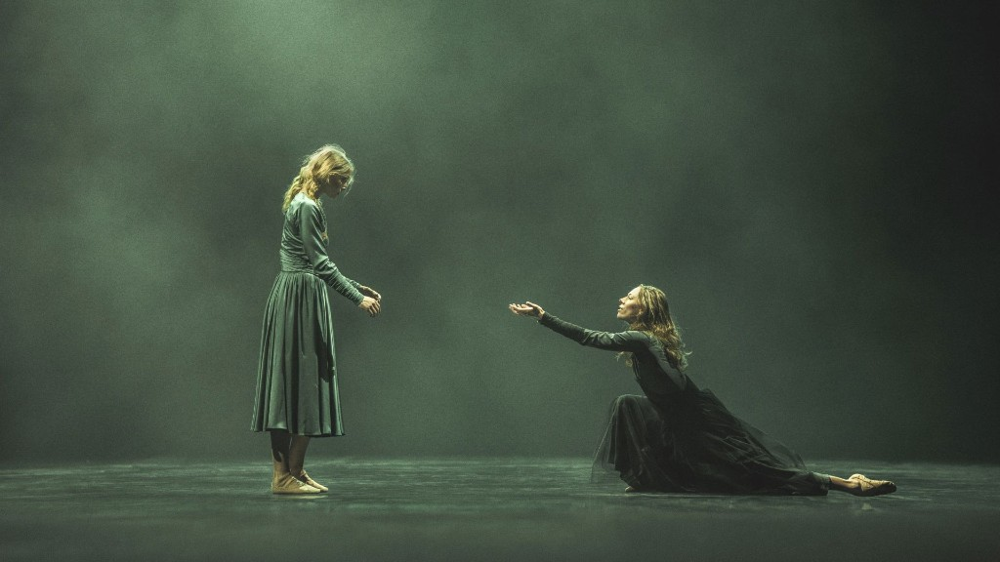

This Thursday I attended the last performance of Akram Khan's Lady Macbeth at the Royal Danish Ballet, featuring Astrid Elbo as Lady Macbeth, Sebastian Pico Haynes as Macbeth, and Emma Riis-Kofoed as Lady Macduff.

And what a show it was.

Genuinely world-class — the kind of work the Royal Danish Ballet stage deserves more of. It was perfect: from the choreography to the dancers' work, from the scenography to the musical accompaniment, from the costumes to the lighting. The whole performance unfolded from beginning to end in a single breath.

Just wow.

<iframe src="https://www.youtube.com/embed/Tfy-bGjxLdU" title="Lady Macbeth — trailer (Royal Danish Theatre)" allow="accelerometer; autoplay; clipboard-write; encrypted-media; gyroscope; picture-in-picture; web-share" referrerpolicy="strict-origin-when-cross-origin" allowfullscreen></iframe>

It was unlike anything I have ever seen before. The whole show felt almost like a meditation session, where your entire attention is absorbed by the hypnotic potion of music, light, and movement.

And if you know Khan's background, you understand where it comes from — tika-taka-tika-taka. The symbiosis of Kathak rhythms and Khan's choreography lays down so damn well on the Bournonville school of ballet, with its lightness and fast feet.

<iframe src="https://www.youtube.com/embed/UBYqv21c0Yk" title="Kathak dance — Taal Dhamaar" allow="accelerometer; autoplay; clipboard-write; encrypted-media; gyroscope; picture-in-picture; web-share" referrerpolicy="strict-origin-when-cross-origin" allowfullscreen></iframe>

The same goes for the stage design. Being brought up on Vaganova, with its grandiosity in everything, including stage decor, I have mixed feelings about Scandinavian minimalism. Sometimes I feel like there is too much of too little.

Khan's production, on the contrary, was in the best Nordic tradition: very minimal — just a huge wooden root that slowly grows into a tree. But this was another example of minimalism done just right. Together with the superb lighting, it created a perfect picture of harmony: adding to the ballet, focusing attention on the movement, and taking nothing away from it. That is something I often miss in other Scandinavian productions, where the poverty of decoration can leave the feeling of a naked podium.

*The corps de ballet — light, haze, and stillness.*

The same can be said about the costumes: nothing excessive, just enough to highlight the movements and bring the desired atmosphere and mood to the stage. Very good work here as well.

The choreography was also at the very top: innovative without pushing itself into the kind of creative insanity that many modern art forms are prone to. I was especially fascinated by Khan's work with hair — how he uses it to create images and symbols. The highlight for me was the moment when the seers stood in a circle, holding each other's hair, making them look as if they were all connected, like a single body, centered on Lady Macduff — making her feel like just the face of that body.

*The seers, connected by their hair and centred on Lady Macduff.*

And the dancers, of course.

Astrid Elbo's dramatic work as Lady Macbeth was amazing, and Sebastian Pico Haynes brought incredible expressiveness of movement as Macbeth.

*Astrid Elbo as Lady Macbeth.*

*Sebastian Pico Haynes as Macbeth.*

Apart from a few light misses from the corps de ballet, the execution was perfect. Everyone did their job very well.

But my favorite of the evening was Emma Riis-Kofoed. She entered, through her dance, into an ecstatic, almost esoteric state that was impossible not to share with her. It was hypnotizing to watch.

*Astrid Elbo and Emma Riis-Kofoed in Akram Khan's Lady Macbeth.*

If there were a chance to see this show again, I would do it more than once.

I am in love. I'll be following Khan's productions from now on.
