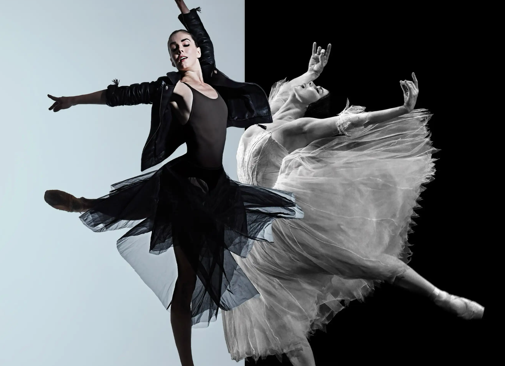

"Force of Nature"... It is hard to find a better description of who Natalia Osipova is in the world of ballet.

Not beautiful in the classical sense. Not technically "clean." Not spotless. And yet captivating, inevitable, breathtaking.

When she dances, there is nobody between her and the music. She is like a child fully dissolving into it. She dances as if there were no audience, as if she were alone with herself — not on stage, but somewhere in her bedroom — and you, almost like a criminal, secretly watch through a peephole. It makes the experience of watching her intensely intimate, and thrilling.

You feel every emotion with her, carried like electricity from the tips of her fingers to the gentlest flutter of her lashes. Sadness, happiness, anger, fear, grief, love... This pure, rough, wild emotion confined within the strict vocabulary of classical ballet makes her one of a kind.

Now, coming back to yesterday's performance.

It was amazing to see Osipova, Tsygankova, Kittelberger, Potskhishvili, Revé, Torres, and Serrano — all on a single stage in Copenhagen! I was slightly surprised that it was not fully sold out. Then again, considering there was almost no advertisement for the event, perhaps I should not have been. The audience compensated for the empty seats with an exceptionally warm welcome. I cannot remember hearing a Copenhagen audience so excited before — and for a good reason.

And even though there is absolutely zero complaint about the dancers — they completely justified their status as world stars — the evening itself was still slightly disappointing.

First, the organisation deserved to be better.

The performance began 20 minutes late, with long and somewhat awkward pauses between pieces, and programmes available only for cash in a country where people have practically forgotten what cash looks like over the last ten years.

But even more confusing was the programme itself. The first half consisted of five choreographies, though they were performed in an entirely different order from the one announced. That, of course, is hardly a tragedy. More puzzling was that the cast list seemed to have only a vague relationship with reality.

Natalia Osipova was listed as dancing the grand pas de deux from Le Corsaire — she did not. It was Anna Tsygankova. In Damaged Skin, Jason Kittelberger appeared as the sole performer, only for the piece to reveal itself as a duet, with Patricia Torres Díaz sharing the stage. Somewhere between the reshuffled programme, the incorrect casting, and trying to understand who was actually dancing what, the evening unexpectedly acquired an element of detective fiction. Not exactly the genre one hopes for at the ballet.

Second, Osipova is fascinating precisely because she is so different from what we traditionally imagine a ballerina to be. There is something extraordinary about seeing her untamed energy locked within the strict vocabulary of classical ballet. That is why it was so compelling to watch her in La Fille mal gardée or Giselle — choreographies so familiar to anyone who loves ballet.

It is not less interesting, of course, to see her dance contemporary pieces. But they leave a different impression, precisely because they lack the harness of classical ballet. Even though she remains a superb dancer, modern choreography does not reveal her uniqueness in quite the same way. Moreover, contemporary excerpts are harder to experience in their full emotional weight when detached from their original context. Unlike familiar classical repertoire, they ask the audience to enter an unfamiliar world with very little guidance.

And last but not least — the music.

Hearing dancers of this calibre perform to a recording unexpectedly brought me back to my own youth, dancing in DK Koroleva in Kyiv. Nostalgic, certainly — though perhaps not in the way the organisers intended.

There is something irreplaceable about live music in ballet. The breathing together of orchestra and dancers, the tiny adjustments, the feeling that movement and sound are born at the same moment. A recording, however polished, inevitably flattens that living dialogue.

And with tickets comfortably above 1,000 DKK, one could not help wondering: could they truly not afford at least a few live musicians?

So, to sum up: it was an event to remember for life, simply because of seeing all these stars with my own eyes for the first time. And considering that Osipova is 40, perhaps this was my last chance to see her dance — unless life brings me to London any time soon.

For the rest... it was okay-ish.
