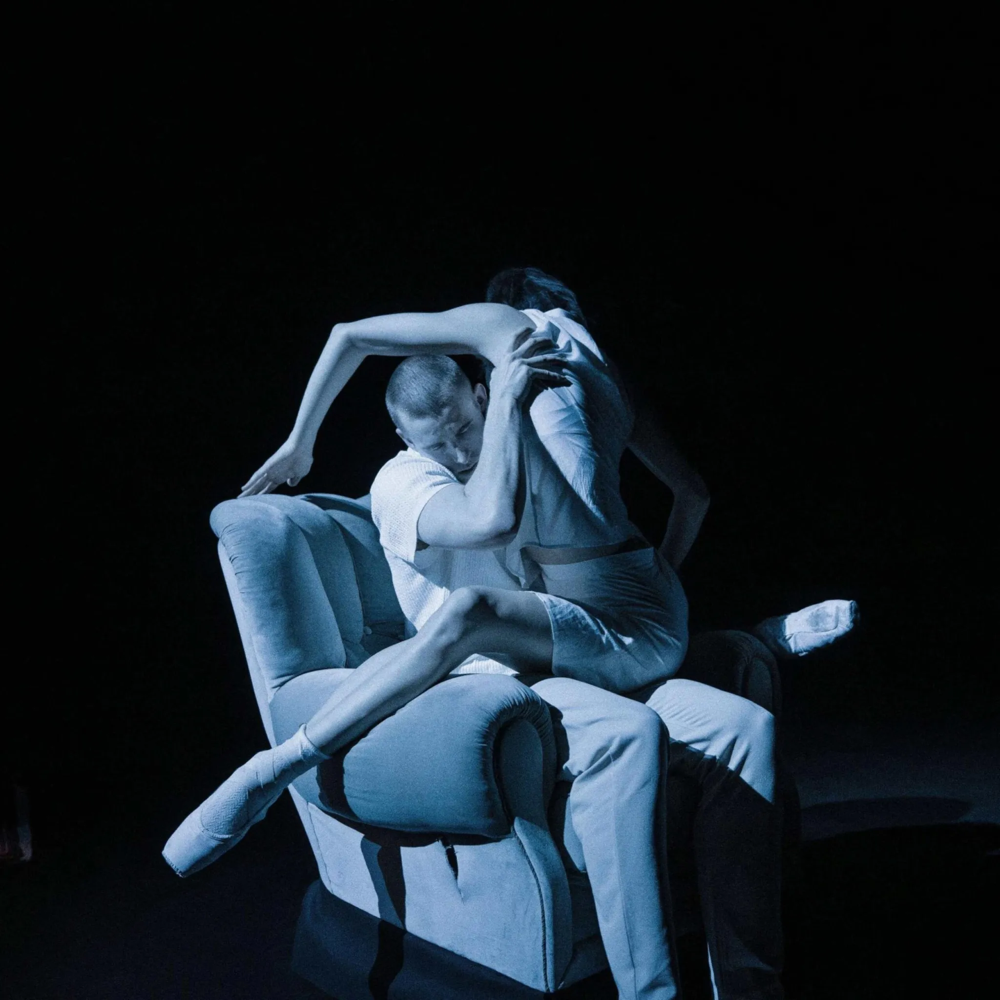
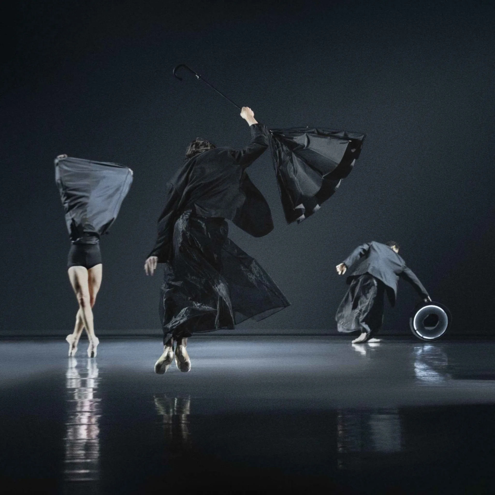

It has been a while since I experienced an art form so intense that hours later I still could not let it go — replaying it in my head again and again, rethinking what I had just witnessed.

Koreorama No. 3, which premiered today at the Royal Danish Theatre, is without a doubt the most interesting performance I have seen in the past year.

Each year, the Royal Danish Theatre selects several young choreographers and gives them the opportunity to work with the theatre's finest professionals — encouraging creativity, bold ideas, and new approaches to ballet.

This year, three choreographers presented their works. Each left such a strong impression on me that I honestly cannot say which one I liked most. I truly loved all three — but for entirely different reasons.

The first piece told the story of King Arthur and the fall of Camelot. What fascinated me most was how Emerson Moose used the language of body and music as instruments of narration. Watching it felt like listening to a fairy tale — but without words. And yet, somehow, you could almost hear them. The dancers seemed to speak through movement alone, and it made perfect sense.

*Maclean Hopper, Birgitta Lawrence and Georgi Kapitanski in MIGHT FOR RIGHT by Emerson Moose. Photo: Camilla Winther*

The second performance was simply aesthetically stunning — a swirling funnel of emotions. Watching the dancers gave me the same feeling I had in Amsterdam when I saw Van Gogh's Sunflowers for the first time. Every movement felt like a brushstroke — deliberate, expressive, alive. If Lorenzo Di Loreto were not a choreographer, he could easily have been a painter — or perhaps a gifted photographer.

*Lania Atkins and Jimmy Coleman in Lorenzo Di Loreto's YOU, LUCIFORM. Photo: Camilla Winther*

And then the third: Linn Fletcher.

Her imagination seems boundless. I can hardly imagine anything more "modern" than her EI BLOT TIL LUST. It was a bouquet of experimentation — with shapes, light, sound, movement, costumes, forms — all woven into one extraordinary performance. At one point, it felt as if a black-and-white image of the stage was slowly absorbing color, growing brighter and brighter with each passing second. The lighting was incredible. The combinations were unexpected. Everything felt bold, daring, alive.

*Blanche Charlot, Marcus Steenberg and Joseph Aumeer (and off-screen Agnes Rosendahl and Ludwig af Rosenborg) in Linn Fletcher's EI BLOT TIL LUST. Photo: Camilla Winther*

Seriously, my dear friend — if you are in Copenhagen and love theatre, you must see it.

It is unforgettable.
