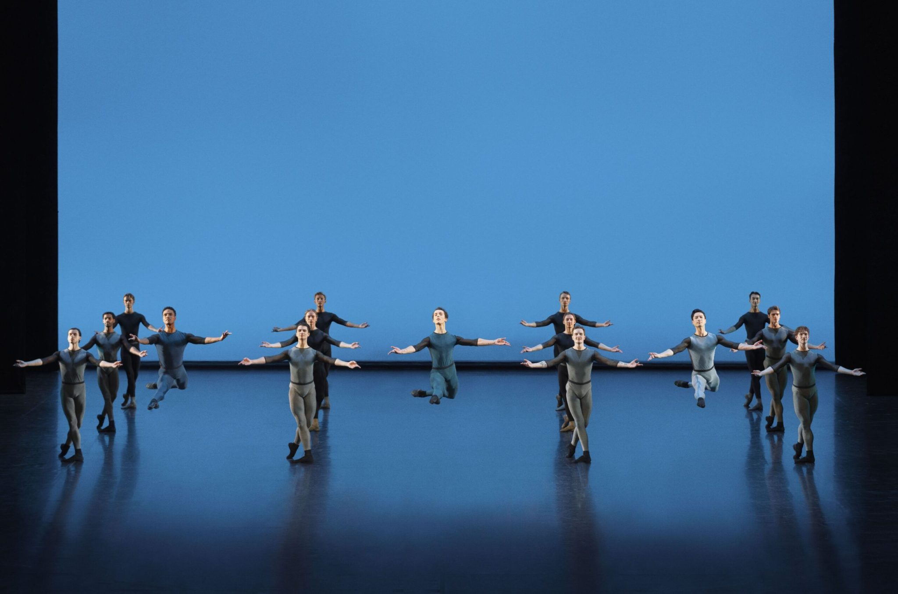
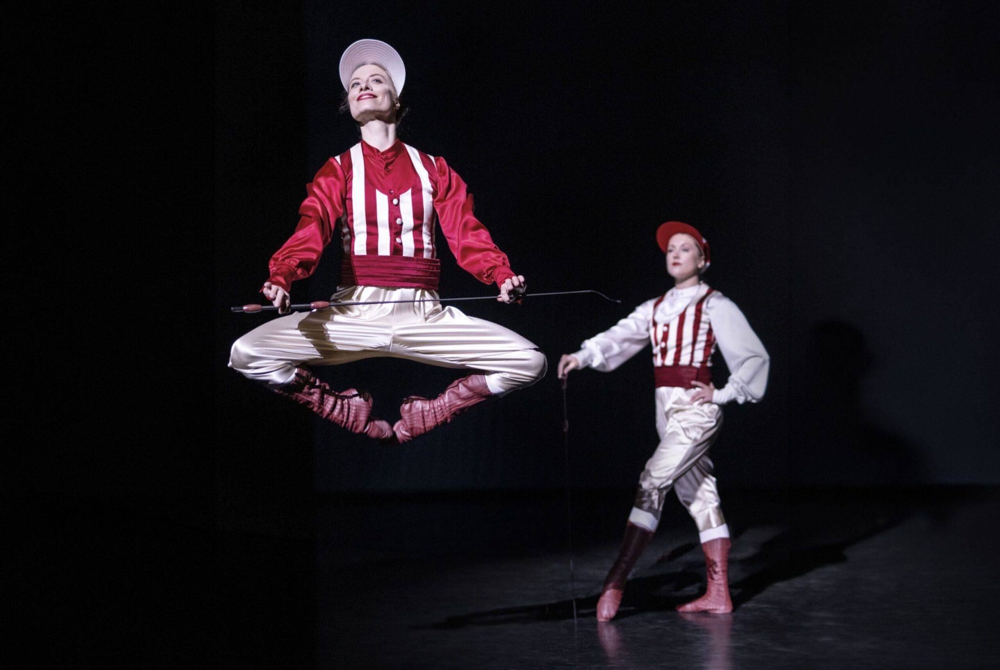
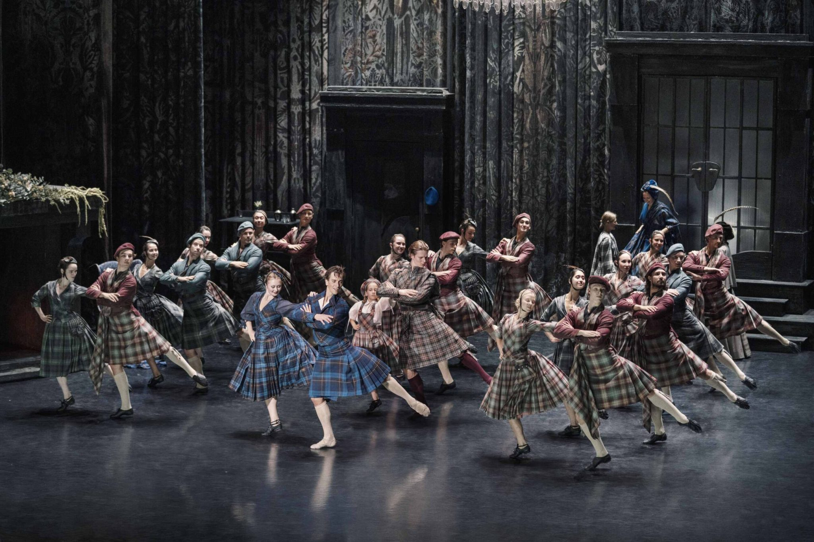
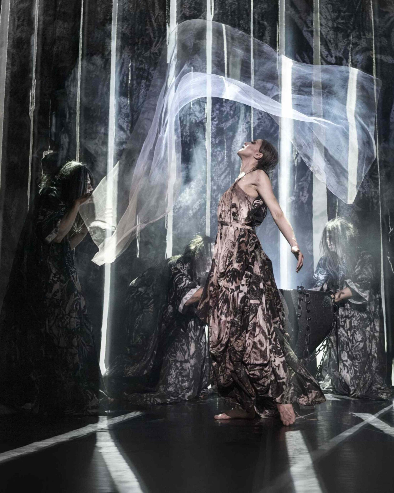

This Saturday, just a little more than a week after August Bournonville’s 221st birthday, I had
the privilege of celebrating him at the Royal Danish Ballet, which opened the season with Til
glæden (“To Joy”) — a real feast of the Bournonville tradition.

When I write about ballet, I usually try to do it before reading reviews or criticism. I want to
keep my impressions as clean as possible from other people’s opinions, so that the first
feelings and thoughts are really mine. This time I cheated. Before I managed to sit down and
write, I came across [Knud Arne Jürgensen’s fresh review of the
premiere](https://pov.international/boelgedale-og-boelgetoppe-i-den-kongelige-ballets-fejring-af-bournonville/)
and simply could not resist reading it.

I have followed his ballet criticism since I moved to Copenhagen six years ago. He is one of
very few people in Denmark who consistently writes about the Royal Danish Ballet’s
premieres, and I read his reviews hungrily. Quite often I wonder afterwards if we actually
watched the same ballet, because our impressions can differ a lot. But as someone who is
just a balletomane and a former amateur dancer, I have great respect for the depth of his
knowledge, not only of ballet, but also music, dramaturgy, history and scenography.

This time, however, I surprisingly found myself agreeing with him quite a lot. Though definitely
not about everything.

## The naked stage

In the first part of the evening — Jockey Dance, the wedding pas de deux from Abdallah, and
August 2.0 — my eyes, just like Jürgensen’s, felt a little uncomfortable looking at the naked
stage.

I grew up in Ukraine, where my understanding of classical ballet was mostly formed by the
Vaganova tradition, which can be quite pompous not only in choreography, but also in
scenery, costumes and the whole theatrical presentation. So when I first came to ballet
performances in Denmark, it was almost a shock to me how empty and minimalistic the
stages could be. I simply explained it to myself as Scandinavian aesthetic asceticism,
something you see in architecture, furniture, clothes and interiors as well. With time I got used
to it and even started to like it.

So it was quite funny to read that someone like Jürgensen, who grew up much closer to the
Danish ballet tradition than I ever did, also felt that the stage was simply too empty. Then
maybe it was not only my Vaganova roots whispering this to me.

At the same time, I understand the intention. If you remove everything from the stage, you
force the audience to look at the dance. There is nowhere else for the eyes to go, nothing
stealing attention from choreography and music. And I actually think this worked very well in
August 2.0. The whole idea of the piece is to take Bournonville’s choreographic vocabulary
and almost separate it from everything else, so the naked stage fits it perfectly. It almost

sterilises the choreography from the surroundings and serves Bournonville pure: steps,
jumps, rhythm, musicality.

*Sebastian Pico Haynes, Philip Duclos and Meirambek Nazargozhayev with the corps de ballet in August 2.0. Photo: Camilla Winther.*

But this did not work equally well in the other pieces. Jockey Dance in the middle of an empty
stage felt slightly strange, almost like watching a rehearsal rather than a finished
performance. I agree with Jürgensen that even something very simple in the background
could have helped, just enough to give the eyes some context without distracting from the
choreography. What did not bother me was the coquettishness of the two jockeys, which he
criticised. Actually, I liked it, and this becomes important later when we get to La Sylphide.

*Lena-Maria Gruber and Tara Schaufuss as jockeys in Jockey-dans. Photo: Camilla Winther.*

The empty stage worked even worse for me in the wedding pas de deux from Abdallah. The
costumes were rich and festive, while everything around them was completely empty, and
somehow the contrast made the stage look even emptier. This is supposed to be a wedding,
a reunion, the culmination of happiness after everything the characters have been through. I
have never seen a wedding, even a very poor one, with absolutely no decoration.

But the stage was still not the biggest problem. I also agree with Jürgensen that there was
something missing from the joy itself. Eukene Sagues and Liam Redhead danced technically
very well, and I hate being harsh on dancers because I know how much work goes into every
performance, but technical quality is not always enough. I simply did not feel that they were
happy to dance with each other. Their solos felt more alive to me, as if they enjoyed the
movement more when dancing separately than together. For a wedding pas de deux, that
matters.

## And then came La Sylphide

Here my agreement with Jürgensen mostly stopped, because I thought La Sylphide was
almost perfect. Maybe not from a purist understanding of Bournonville, but very successful as
an attempt to revitalise him.

If the Royal Danish Ballet wants only to preserve Bournonville by repeating exactly how things
were done before, then it becomes preservation in a museum sense. But if the idea is really
revitalisation, then we also have to allow some things to change. For me, the important
question is whether the things that make Bournonville Bournonville are still there.

And they were. The lightness, the quick footwork, the musicality, and especially this very
special Bournonville feeling when the legs are doing something incredibly complicated and
fast while the upper body somehow looks relaxed and effortless. In La Sylphide, I really felt it.
The dancers did not seem to walk into the forest; they almost floated into it. I did not need to
convince myself that I was entering a magical world. The ballet did it for me.

*Agnes Rosendahl as Effy, Alexander Bozinoff as James and Phillip Katsnelson as Gurn with the corps de ballet in Sylfiden. Photo: Camilla Winther.*

## A more earthly Sylph

The part I liked most is actually the part Jürgensen criticised the most. This La Sylphide is
more sensual, more sexual and, yes, more “earthly”.

Stephanie Chen Gundorph’s Sylph is not only an innocent, untouchable air spirit. She flirts,
she knows she is attractive, and sometimes it feels like she understands perfectly well what
she is doing to James. Madge, danced by Astrid Elbo, is even more physical and sexual.

*Astrid Elbo as Madge in Sylfiden. Photo: Camilla Winther.*

Jürgensen sees this as weakening both characters. In his understanding, the Sylph loses
some of her allegorical and supernatural nature, while Madge becomes too physical and
loses some of the mystery and power she traditionally has. I understand his point, but I do not
really agree.

Because desire was always part of La Sylphide. James is about to marry Effy when another
creature appears in front of him — beautiful, impossible, mysterious and forbidden — and
suddenly the life he was supposed to have is not enough anymore. He wants something else,
something he cannot really possess. That is already a deeply sensual story.

So I do not think adding more sexuality suddenly destroys the meaning of the ballet. Maybe it
simply makes the meaning more visible to us. Bournonville created this ballet in 1836, and
people then and people now do not necessarily read the same gestures and symbols in the
same way. Something that was immediately emotionally clear to a nineteenth-century
audience can today look distant or abstract. Making the Sylph more consciously seductive
may therefore be less about changing the story and more about changing the language
through which the same temptation is communicated.

And this is where I see a contradiction in Jürgensen’s review. He begins by defending the
importance of constantly revitalising Bournonville, but when the interpretation actually moves
away from the traditional one, he becomes uncomfortable with it. Maybe this is really the
biggest question behind the whole evening: how much can you change before you stop
revitalising Bournonville and start rewriting him?

I do not know the answer. Obviously, you cannot change absolutely everything and still call it
Bournonville. But the opposite can also be dangerous. If we are so afraid of changing
anything that every gesture, character and dramatic meaning has to stay exactly as it was
traditionally interpreted, then eventually the ballet can become something we respect more
than we actually feel.

What I liked about this La Sylphide was exactly that I could clearly recognise the old ballet
while at the same time the characters felt emotionally understandable to me today. The
choreography was still Bournonville, but the people inside it did not feel locked in 1836.
Especially James. I can intellectually understand the idea of a man being tempted by an
ethereal spirit representing another life, another world, another possibility. But intellectually
understanding something and emotionally feeling it are not the same thing. Make the Sylph
more sensual, more playful and more obviously tempting, and James suddenly becomes
easier to understand. I still want to shake him and tell him not to destroy his life, but at least I
understand why he does it. And this makes the tragedy stronger for me, not weaker.

## To joy, then

All in all, I think Mr August Bournonville would probably have been quite happy with his
birthday celebration. Not everything during the evening worked equally well. August 2.0
showed me that an empty stage can be exactly right when choreography itself is the whole
subject. Jockey Dance showed me that sometimes the eyes still need something around it.
Abdallah reminded me that technical perfection is not enough if the audience cannot feel the
emotion the scene is supposed to be about.

And La Sylphide reminded me why Bournonville is still interesting at all. Almost 200 years
later, we are still arguing whether the Sylph should be innocent or seductive, whether Madge
should be supernatural or physical, whether the stage should be empty or decorated, and
how far Bournonville can be changed before he stops being Bournonville.

I think this is a very good sign. The worst thing that could happen to Bournonville is not that
somebody changes him too much. The worst thing would be if nobody cared enough to argue
about him anymore. If almost 200 years later his ballets are still able to seduce us, irritate us,
make us disagree and leave the theatre wanting to continue the discussion, then the tradition
is still very much alive.

Bournonville does not need to be frozen in time. He needs to be danced, questioned,
sometimes challenged, and danced again.

The world needs more Bournonville.

## Other reviews

I searched Danish and English sources broadly. As of 5 September 2026, I could find six
published reviews or critical pieces of *Til glæden*. Previews, press releases and articles
published before the premiere are excluded.

| Outlet / critic | Rating | Overall verdict |
| --- | ---: | --- |
| [Kristeligt Dagblad — Alexander Meinertz, “Heksens hævn”](https://alexandermeinertz.dk/heksens-haevn/) | 6/6 | Meinertz is quite critical of the programme before *Sylfiden*, which he calls pietetsfuld, dutiful and somewhat museum-like. But he considers the newly interpreted *Sylfiden* outstanding, especially Astrid Elbo’s Madge and the dramatic structure; Ryan Tomash receives exceptional praise as James. The six stars appear primarily to concern *Sylfiden*. |
| [ISCENE — Dorte Grannov Balslev](https://iscene.dk/2026/09/03/til-glaeden-puster-nyt-liv-i-bournonvillearven/) | 5/6 | Very positive about the whole evening, especially the male dancers in *August 2.0*, the orchestra, Gundorph and Fransson, and the less caricatured, more naturalistic *Sylfiden*. She says the company handles its heritage much better than last season. |
| [SCENEBLOG — Casper Koeller](https://sceneblog.dk/anmeldelse-til-glaeden-den-kongelige-ballet-gamle-scene/) | 5/5 | Unambiguously enthusiastic. He calls Watson’s Bournonville initiative a pragtfuld idé, particularly likes *August 2.0*, Astrid Elbo, Stephanie Chen Gundorph and Jón Axel Fransson, and argues that Bournonville still speaks directly to a modern audience. |
| [KULTURINFORMATION — Louise Frevert](https://kulturinformation.org/ballet-anmeldelse-til-glaeden/) | 5/5 | Very enthusiastic, especially about Bournonville’s technical demands. She calls *August 2.0* a bold, refreshing liberation of Bournonville technique and strongly praises Fransson and Gundorph in *Sylfiden*. Her only minor criticism concerns ensemble precision. |
| [Kulturkupeen — Ulla Strømberg](https://www.kulturkupeen.dk/til-glaeden-2026-bournonville-paa-det-kongelige-teater/) | 5/5 | More critical than the five stars suggest. She thinks the female *Jockey-dans* becomes mest til pjat, dislikes the bare orange setting for *Abdallah*, and finds *August 2.0* visually dreary. But she thinks *Sylfiden* elevates the evening: Fransson is superb, Elbo a powerful Madge, and the production visually magnificent. |
| [POV International — Knud Arne Jürgensen](https://pov.international/boelgedale-og-boelgetoppe-i-den-kongelige-ballets-fejring-af-bournonville/) | No stars | By far the most critical review. He likes parts of the dancing, especially Tobias Praetorius and Emerson Moose, but finds the stripped-down presentation poor, *Abdallah* too cautious and *August 2.0* repetitive. His biggest objection is *Sylfiden*: Gundorph’s Sylph and Elbo’s Madge are, in his view, made too earthly and sexual, losing some of Bournonville’s supernatural ambiguity. |
