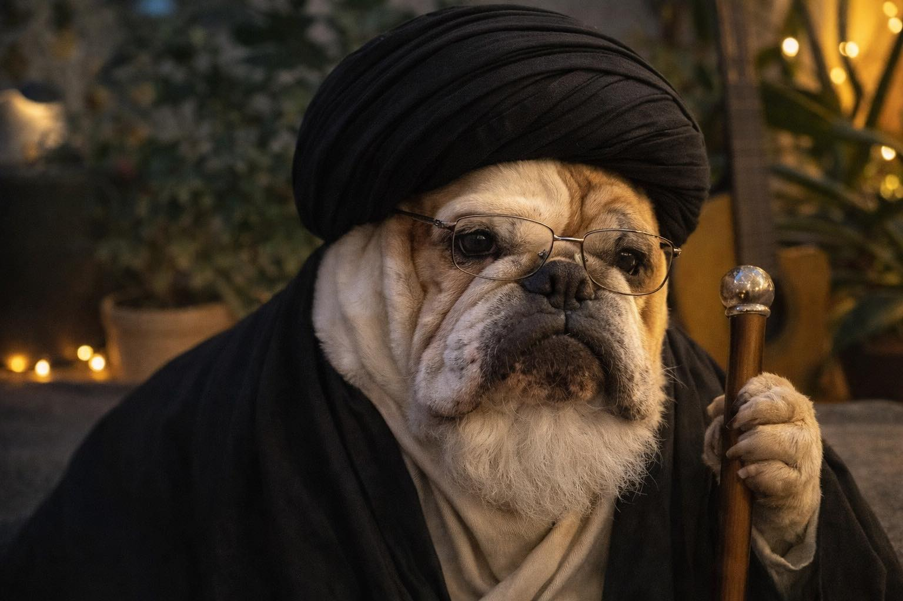

The world has never felt so fake to me as it does today.

Fake texts flood the Internet. Fake pictures that are hard to distinguish from real ones. Fake videos that feature generated people who look real. And real people who do everything to look and feel fake.

Someone said that before AI solves all humanity's problems, it will unlearn how to express them.

At work, I've found that people stopped exchanging their own thoughts and opinions at some point and instead started exchanging LLM outputs. Perhaps it is the right time to just connect our LLMs through some MCP servers and let them decide who is "right."

AI is great, like a spade is great for digging soil (I tried using my hands once—spade is better, I swear). When it replaces your lover… well, some might not agree, but it feels wrong to me.

Someone also said that AI will make us more human. The logic is that, just like we appreciate handmade things today more than ever before mass-produced products entered the market, we will start appreciating human imperfection more with the rise of AI. And to be fair, I did start seeing beauty in the raw and imperfect… The catch is that the overwhelming majority of our things are still mass-produced.

Perhaps it is not wrong. Perhaps it is just a new turn of the spiral of history, like photography replacing painting in the 19th century—AI-generated media now replacing photography, and so on.

Not so long ago, I was the one defending online communication between people. I argued that online communication is not worse than offline, not less human—it is just different. I also defended e-books against "traditionalists" who attached some "magic" to paper books. For me, books were the same books as long as they transmitted information from the author to the reader, regardless of the medium. Why should AI-generated conversations or books be different? If one cannot spot the difference… shouldn't it be the same if we drop the esoterics?

From a utilitarian point of view, there is no difference whether you like a book, picture, conversation, or whatever, if it is made by a human or AI. As long as you, as a human, enjoy it without prejudice against anything non-human-created, it should not matter how it came to life.

All AI-generated content has a big problem as of today—this particular robotic smell. Even words generated by machines and put into humans' mouths drastically reek of it. This odor is what makes me feel the world being more fake right now than ever.

One day AI might get rid of its robotic smell (will it?). Will the world then feel less fake?

Perhaps it will, but removing humans from the equation will just create a higher-quality counterfeit, not remove the fact that it is still an attempt to fake the human. Consequently, we will get a shift of reality once again. The world will become even more efficient. Even more pragmatic. But less and less human. The line between a human and a robot will become indistinct to the eye at some point (and it is fair to say it already partially has). The only thing that will never be solved by machines is the human capability for empathy.

Empathy is not esoteric; it is a factual ability of living creatures to experience the same emotions as other living creatures. Robots can replicate it, fake it, but never truly obtain it without biology.

Perhaps science will also be able to solve this soon (write down the idea for a biotechnological startup—or wait… Elon Musk is already working on it). In any case, the age of Homo sapiens sapiens is giving up its place to a new species—Homo sapiens technologicus—already today. The "sapiens" part is increasingly being replaced by the "technologicus" part, and the latter will eventually lose its place in the world to Homo roboticus, like Neanderthals lost it to Homo sapiens. The spiral of history is inevitable. And only nuclear weapons seem able to prevent all this from happening.

Good Sunday.

P.S. In the picture: me visiting Iran before the Islamic Revolution. No AI was used.

