

This post is part of a series of excerpts from <i>Early Teapots II</i> — a book by Dr. Lu Chi Lin — and from discussions 
in <a href="https://www.facebook.com/groups/teapot2">the related Facebook group</a>, which offers a wealth of knowledge 
about antique Yixing teapots. Since both the book and the group's discussions are primarily in Chinese (with only a few 
chapters translated into English), this series aims to make this invaluable information on the magnificent art of Yixing
accessible to a Western audience that still lacks such resources.

All credit goes to Dr. Lu Chi Lin and the many dedicated members of the community inspired by his work, who generously
share their expertise and passion.

Source: https://www.facebook.com/groups/teapot2/posts/1639756562985674/

## 13 Seals

Presented here is a collection of base seals from Nei Zi Wai Hong Xishi teapots (purple clay interio, red clay 
exterior), all originating from the same production batch of the Green Label period.
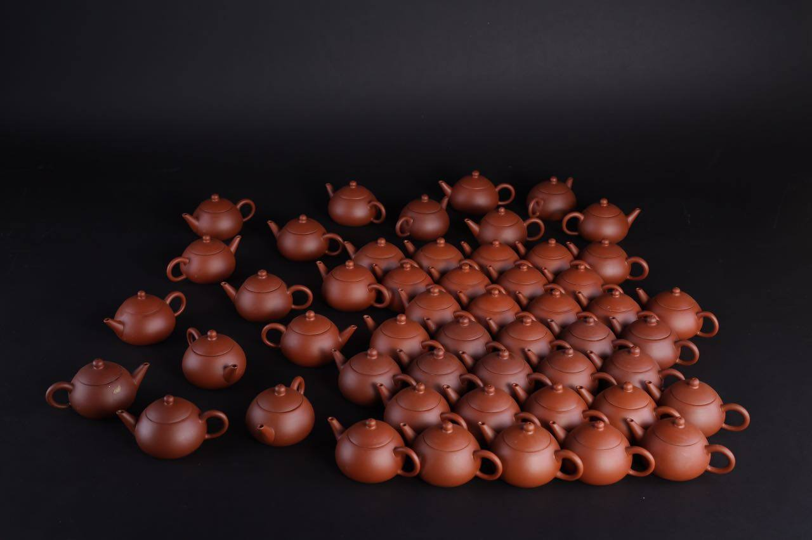
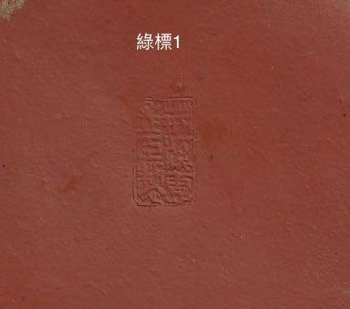
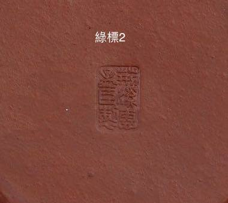
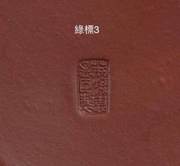
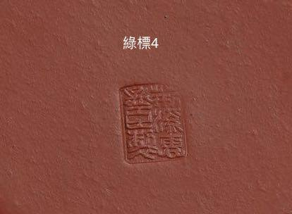
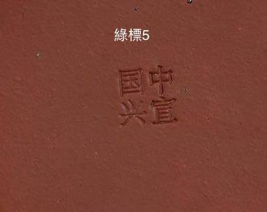
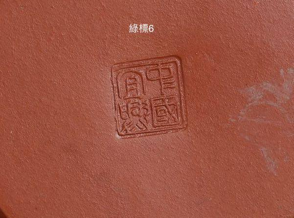
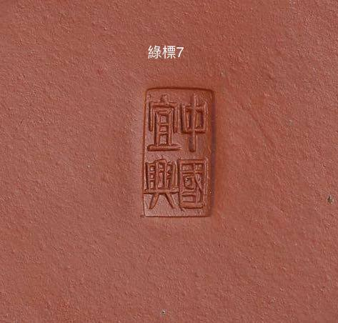
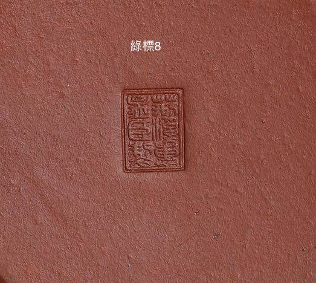
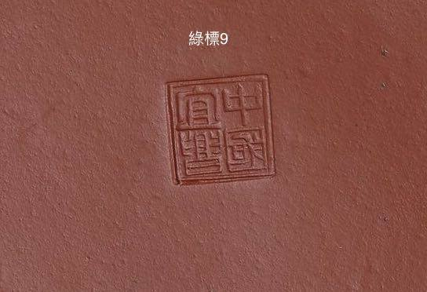
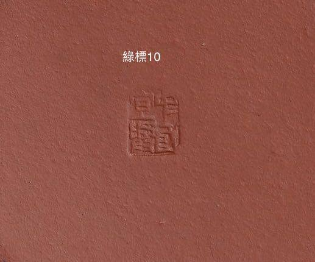
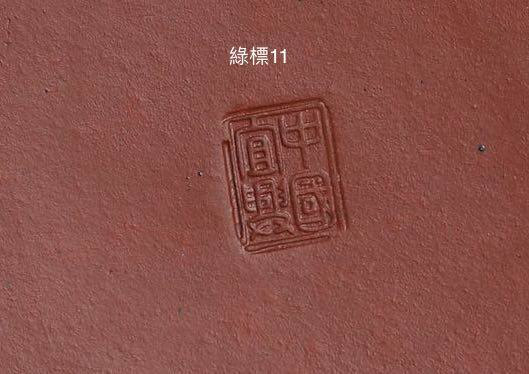
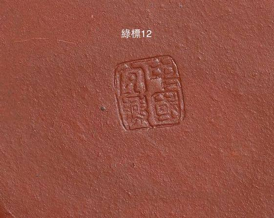
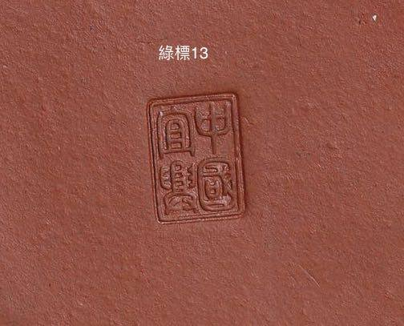
