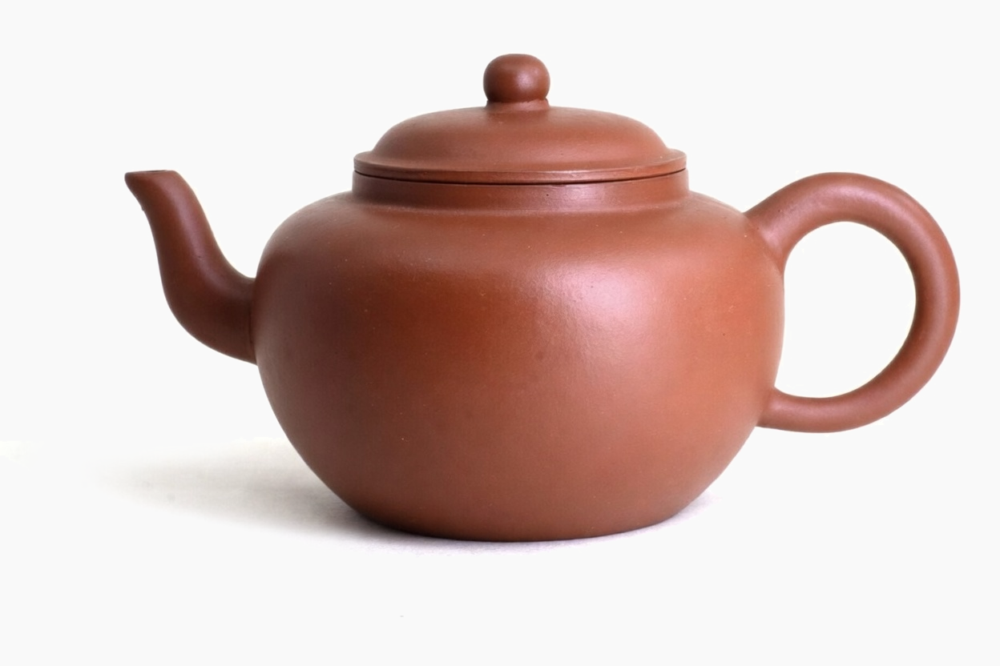
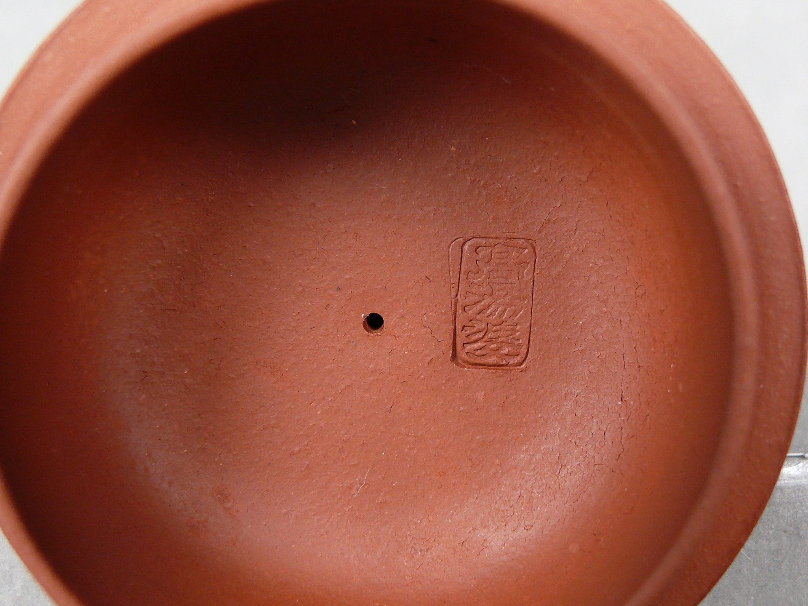
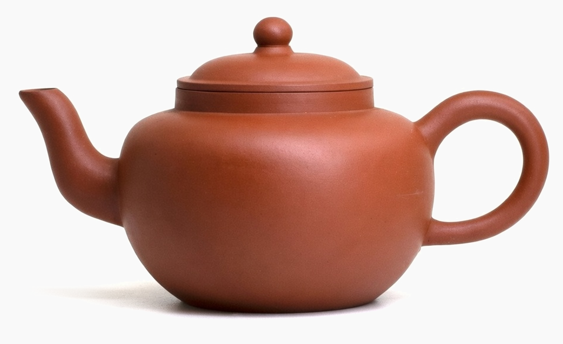
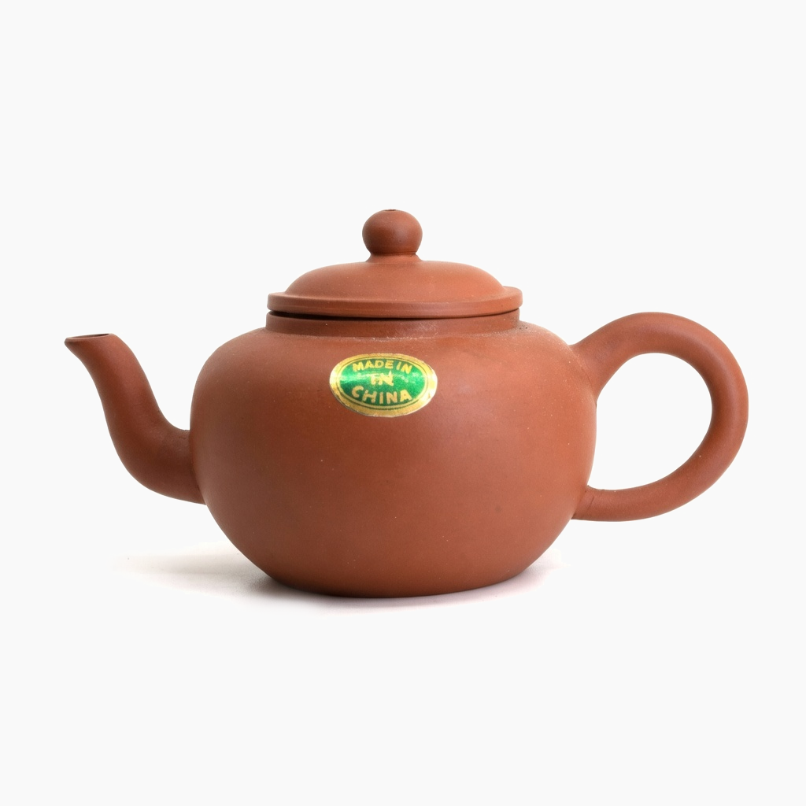

This post is part of a series of excerpts from <i>Early Teapots II</i> — a book by Dr. Lu Chi Lin — and from discussions 
in <a href="https://www.facebook.com/groups/teapot2">the related Facebook group</a>, which offers a wealth of knowledge 
about antique Yixing teapots. Since both the book and the group's discussions are primarily in Chinese (with only a few 
chapters translated into English), this series aims to make this invaluable information on the magnificent art of Yixing
accessible to a Western audience that still lacks such resources.

All credit goes to Dr. Lu Chi Lin and the many dedicated members of the community inspired by his work, who generously
share their expertise and passion.

Source: https://www.facebook.com/groups/teapot2/posts/1688216344806362/

When discussing Gao Tang Po (GTP) teapots, the first step is clarifying the origin of the name. Many rumors exist, but the explanation is actually straightforward.

The name “Gao Tang Po” originated in the late 1950s to early 1960s, shortly after the establishment of Yixing Factory #1. Teapots from this period often had “高汤婆 / Gao Tang Po” stamped inside the lid (see figure 2).

Some collectors believe the name was created by Japanese buyers because many of these pots were exported to Japan and used for holding soup stock or soy sauce. This led to alternative names such as “Gao Tang Bottle” or “Soy Sauce Bottle.” However, this interpretation is incorrect.

The term “Gao Tang Po” has nothing to do with soup stock (“gao tang”). Instead, it derives from the “Tang Po” teapot shape discussed earlier in Chapter 4. The Sheng Deng pot was formerly called Tang Po (as shown by the lid seal in figure 1).

Therefore, “Gao Tang Po” simply means a taller version (“Gao / 高”) of the Tang Po shape.

## Origins and Design

Yixing Factory #1 was founded in 1958, during the Great Leap Forward. To increase production, the factory experimented with standardized forms and mold production.

Master artisans such as Gu Jingzhou and Wang Yinchun studied late Qing and Republic-era teapot shapes and developed standardized designs using plaster molds to streamline manufacturing.

The Gao Tang Po shape was designed by Gu Jingzhou and other factory masters, inspired by a late Qing flat-lid lotus form. During the early years of Factory #1, teapot names were stamped inside the lid to distinguish standardized shapes. Examples include:

- Tang Po
- Xian Piao
- Bian Xia
- Bian Pu
- Shi Long

The Gao Tang Po was produced from the late 1950s to early 1960s, and authentic examples display characteristics typical of that era.

## Characteristics of 1960s Gao Tang Po

1. Base Seal
Authentic pieces typically use six-character seals, such as:
- Jing Xi Hui Meng Chen Zhi
- Jing Xi Nan Meng Chen Zhi
- Yixing Hui Meng Chen Zhi

These seals match those used on other Factory #1 teapots of the period.

2. Clay and Firing
1960s GTP teapots were usually fired in downdraft kilns. The clay resembles other Factory #1 wares of the time:
- thin, matte surface
- slightly sandy texture
- appearance similar to red bean paste

This quality is difficult to judge from photographs and is best understood through handling authentic examples.

3. Lid Seal
Most 1960s GTP teapots have “Gao Tang Po” stamped inside the lid. Two main seal styles have been observed.

Many reproductions imitate this stamp, but the calligraphy usually differs and can be identified through comparison.

4. Workmanship
Compared with other teapots of the period, GTP bodies are slightly thicker, likely due to the molds used. As a result, the pots are heavier. Typical features include:
- relatively small lid knob
- finishing marks inside the lid
- air hole construction consistent with other 1960s Factory #1 pots

Examples of 1960s GTP are shown in figures 2–5.

## 1970s Gao Tang Po

In the 1970s, several changes appear:
- Base seal: Zhong Guo Yixing (4- or 6-character version)
- Lid: no longer stamped “Gao Tang Po”

Other differences include:
- slightly altered proportions due to new molds
- larger lid knob
- spout with less refined curvature
- coarser finishing around the spout

The clay also appears brighter or glossier, reflecting changes in clay preparation and firing methods.

## Late 1970s–Early 1980s: Green Label Period

The Green Label period produced another variation of the Gao Tang Po.

Characteristics include:

- highly variable clay quality, ranging from refined “Nian Gao” clay to poorly processed material
- coarser workmanship due to increased production volume
- sloppier finishing and trimming

Six-character base seals reappear during this period, but their style differs from those of the 1960s. Taiwanese collectors often refer to them as “messy six-character seals.”

## Related Form: “Ban Bian Luan”

Another teapot produced in the early 1960s at Factory #1 resembles the Gao Tang Po. Taiwanese collectors call it “Ban Bian Luan” (Half-Sided Egg) because of its egg-like shape.

This form:
- has no lid stamp, so its original name is unknown
- resembles the GTP shape
- is therefore sometimes called “Bian Ti Gao Tang Po” (variant GTP)

Collectors consider it significantly rarer than standard GTP. Later examples from the 1980s “Nei Zi Wai Hong” period show clear differences in molds and finishing.

## Identifying Early Gao Tang Po

Like early pu-erh tea, early Yixing teapots should be understood in the context of their era. Authentic pieces display consistent combinations of:
- seals
- clay material
- firing characteristics
- workmanship

While individual elements can be forged, it is much harder to reproduce all of these characteristics together.

Photographs may not fully convey clay quality, but they still reveal differences in craftsmanship and seals.

## The Appeal of Early Teapots

Collectors often ask what makes early Yixing teapots special. They are not as refined or elaborate as many modern pots. Instead, their appeal lies in their honesty and restraint.

Teapots from the 1960s and 1970s display subtle craftsmanship and especially distinctive clay. When used and seasoned, their material develops a natural beauty that many collectors find deeply appealing.

Their character is simple, pure, and understated, far removed from the more decorative styles common today.
