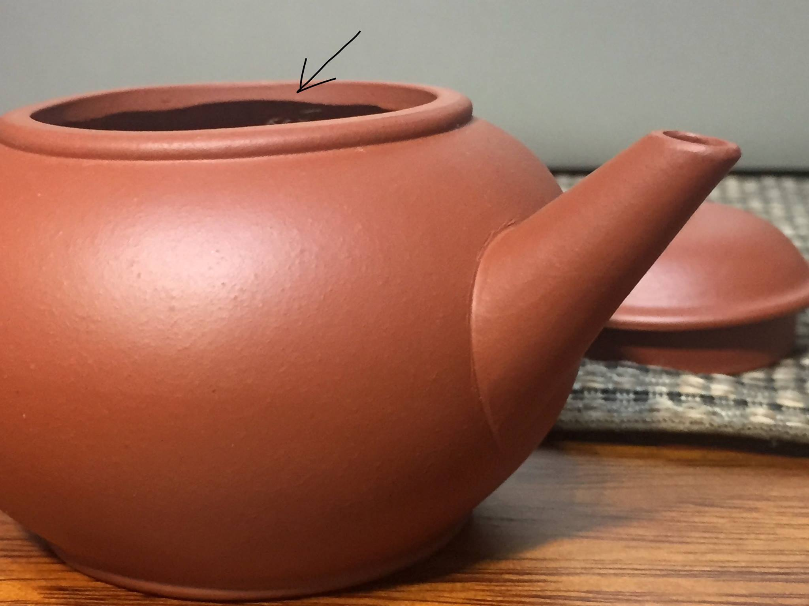

This post is part of a series of excerpts from <i>Early Teapots II</i> — a book by Dr. Lu Chi Lin — and from discussions 
in <a href="https://www.facebook.com/groups/teapot2">the related Facebook group</a>, which offers a wealth of knowledge 
about antique Yixing teapots. Since both the book and the group's discussions are primarily in Chinese (with only a few 
chapters translated into English), this series aims to make this invaluable information on the magnificent art of Yixing
accessible to a Western audience that still lacks such resources.

All credit goes to Dr. Lu Chi Lin and the many dedicated members of the community inspired by his work, who generously
share their expertise and passion.

Source: https://www.facebook.com/groups/teapot2/posts/1628536057441058/

## Finishing Characteristics of Early Teapots (Pre-1980s)

Early teapots produced before the 1980s typically show a clear distinction between exterior and interior finishing. 
Craftsmanship focused primarily on the exterior, while the interior received comparatively minimal refinement.

Inside the body of early teapots, it is common to find residual clay, finger marks, scraping marks, and irregular 
trimming traces. These features are normal and consistent with production practices of the period.

The interior of the lid shows similar characteristics. Residual clay, water marks, wiping marks, and lid walls that are
not perfectly round are frequently observed and should not be considered defects.

On most early teapots, the inner edge of the mouth—when touched from the inside—reveals uneven and sometimes slightly 
sharp trimming marks in the clay body. This is a typical indicator of early finishing methods.

Regardless of the condition of the interior, the exterior of early teapots was generally finished with care. The overall 
form and primary lines are usually orderly and visually balanced.

Conversely, teapots whose interiors (including the inside of the lid) appear excessively refined—uniform, highly 
polished, or showing very fine finishing or steel-burnishing marks—should be examined more closely, as such 
characteristics are not typical of early production.

