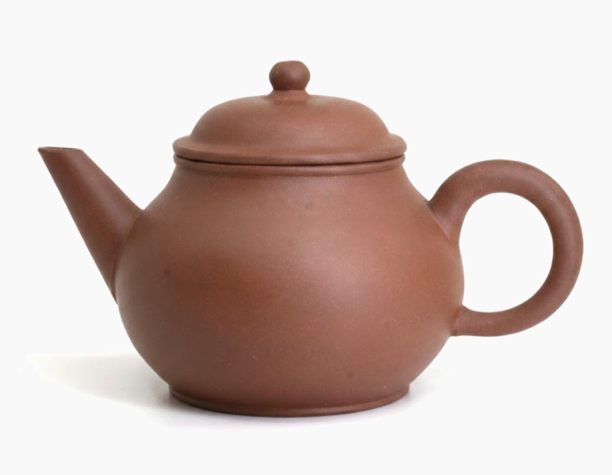
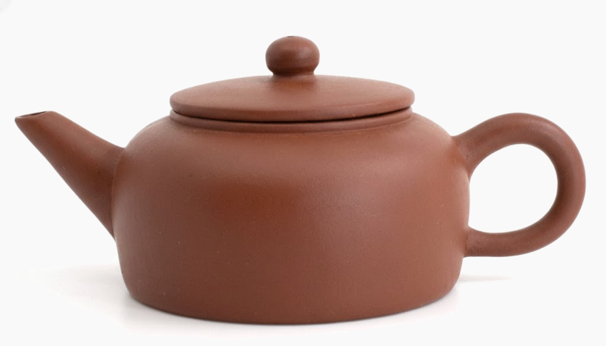
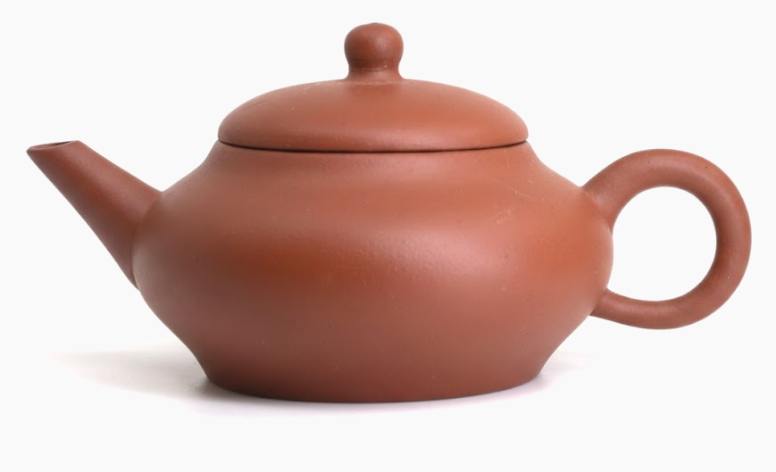
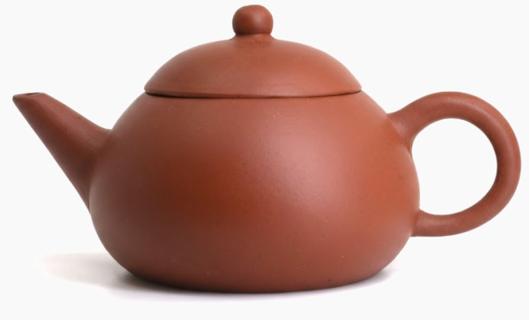
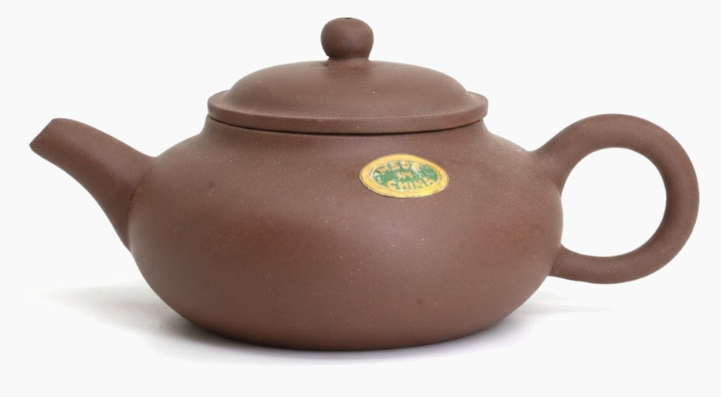

This post is part of a series of excerpts from <i>Early Teapots II</i> — a book by Dr. Lu Chi Lin — and from discussions 
in <a href="https://www.facebook.com/groups/teapot2">the related Facebook group</a>, which offers a wealth of knowledge 
about antique Yixing teapots. Since both the book and the group's discussions are primarily in Chinese (with only a few 
chapters translated into English), this series aims to make this invaluable information on the magnificent art of Yixing
accessible to a Western audience that still lacks such resources.

All credit goes to Dr. Lu Chi Lin and the many dedicated members of the community inspired by his work, who generously
share their expertise and passion.

Source: 

## 1) The Origin of the “Five Shape Pots” Names

Among early Yixing teapots, the Five Shape Pots are especially widespread and well loved. Because of their variety and 
recognizability, they became popular among collectors.

The term **“Five Shape Pots”** was coined in Taiwan in the 1970s, when early teapots began entering the local market in 
larger numbers. The names were created by pioneering Taiwanese collectors, based mainly on the pots’ external shapes or 
visual characteristics. Examples include:

- **Ba Le** (Fig. 1), meaning *guava*
- **Rou Bing** (Fig. 2), meaning *meat cake*
- **Bian Deng** (Fig. 3), meaning *magical lamp*
- **Xi Shi** (Fig. 4), named after the famous Chinese beauty
- **Tai Jian** (Fig. 5), meaning *eunuch*

<figure class="full-size">

<figcaption>Fig. 1: Ba Le (70s, zini, 101ml)</figcaption>
</figure>

<figure class="full-size">

<figcaption>Fig. 2: Rou Bing (70s, hongni, 75ml)</figcaption>
</figure>

<figure class="full-size">

<figcaption>Fig. 3: Bian Deng (70s, hongni, 73ml)</figcaption>
</figure>

<figure class="full-size">

<figcaption>Fig. 4: Xi Shi (70s, hongni, 74ml)</figcaption>
</figure>

<figure class="full-size">

<figcaption>Fig. 5: Tai Jian (80s, 96ml)</figcaption>
</figure>

These names are essentially localized Taiwanese terms, reflecting the collectors’ own experiences and interpretations 
rather than official factory designations.

When these shapes were produced at **Factory No. 1 (F1)**, official names were assigned and stamped inside the lids, 
particularly in the early 1960s. Other shapes—such as **Bian Yuan** or **Li Zi** (*pear*)—were named much later.

Some collectors believe that Five Shape Pots did not exist in the 1960s and were only produced in the 1970s. This view 
likely stems from limited familiarity with early production history. In reality, Five Shape Pots with name stamps inside 
the lids clearly appeared in the 1960s; the practice of stamping names was discontinued later.

This naming practice parallels another early standardization feature at F1: stamping the **number of cups** inside the 
lid. During this period, several shapes were standardized, including **Xian Piao** (Fig. 6), **Bian Xia** (Fig. 7), 
**Tang Po** (Fig. 8), and **Bian Pu** (Fig. 9). These four can be reliably dated to the 1960s.

The fifth shape, known in Taiwan as **Tai Jian**, has not yet been observed in confirmed 1960s examples. Based on 
available evidence, it was likely produced by F1 beginning in the 1970s.

Beyond their typical early-teapot characteristics—such as clay quality and workmanship—the Five Shape Pots also reflect 
forms commonly seen in the early ROC period. For anyone interested in the evolution of **shuiping** teapots, these 
shapes are particularly valuable for study.

---

## 2) Historical Background of Production

To understand the Five Shape Pots, it is essential to understand the historical context of **Factory No. 1**.

Although purple clay was used as early as the Song dynasty, large-scale production of personal art objects began in the 
Ming dynasty, around the Zhengde period (16th century). By the Qing dynasty—especially from the Kangxi to Qianlong 
eras—Yixing purple clay reached a high level of maturity. Teapots, flower pots, vessels, and carved objects became 
increasingly refined and were widely collected both in China and overseas.

From the late 18th to 19th centuries (Jiaqing period), large quantities of Yixing wares were exported to Europe, Japan, 
and Southeast Asia. Production adapted to foreign tastes in shape, clay, and decoration. This export-oriented system 
continued into the early ROC period and laid the foundation for Yixing’s global reputation.

According to *Jiangsu Provincial Records* and ceramic industry records from 1932, Yixing had over **600 artisans**, 
producing more than **two million pieces annually**—an all-time peak. This prosperity ended abruptly during the 
Sino-Japanese War, when workshops and dragon kilns were destroyed and artisans dispersed. Production nearly ceased, 
creating a long interruption in both output and design continuity.

After the founding of the People’s Republic of China in 1949, few artisans remained. In the 1950s, the government 
organized efforts to revive the industry by reuniting craftsmen, training apprentices, restoring exports, and improving 
productivity. During the Great Leap Forward in 1958, the workforce expanded to nearly **2,000**, more than ten times the 
pre-war number.

To further increase output, plaster molds were introduced in the mid-1950s, enabling standardized production of 
**shuiping** teapots. Other techniques, such as wheel spinning and slip casting, were also explored. In the 1960s, 
traditional dragon kilns were gradually replaced by **down-draft kilns**, solving fuel shortages and improving firing 
consistency.

At the same time, F1 expanded its product range by developing simple, practical designs alongside traditional forms. 
Shapes such as **Gao Tang Po**, **Half-Sided Egg**, **Beauty’s Shoulder**, and several Five Shape Pots emerged during 
this period.

---

## 3) Appreciating the Five Shape Pots

Based on clay characteristics and base seals, the Five Shape Pots were first produced in the **1960s**, with continued 
production through the 1970s and 1980s. Collectors therefore need to distinguish between different production periods.

This discussion focuses on the **1960s examples**, which have distinct and recognizable features.

### Clay and Firing

The clay used in the 1960s is among the hardest to replicate today.

- Wartime interruptions allowed raw clay to age naturally for many years before being used by F1 after 1958.
- The transition from dragon kilns to down-draft kilns produced firing effects that differ significantly from later 
- push-slab kilns or modern electric kilns.

1960s clay appears **warm, smooth, and subtly moist**, with very fine sand texture. Before use, many pots show a soft, 
matte sheen. By contrast, 1970s pots tend to have stronger red tones and a noticeably different surface character.

### Workmanship

Early Five Shape Pots from the 1960s were somewhat **experimental**, reflecting F1’s focus on increasing productivity. 
Slip casting with plaster molds was attempted, and under close examination, casting marks can still be found on shapes 
such as **Tang Po**, **Bian Pu**, and **Bian Xia**.

It is said that two master slip casters from Jingdezhen were invited to assist in developing this technique. However, 
due to the difficulty of correcting cast forms, the method was eventually abandoned. Comparing 1960s and 1970s Five 
Shape Pots reveals ongoing changes in molds, joint lines, and proportions, showing continuous refinement by F1.

### Base Seals and Lid Stamps

Five Shape Pots from the early 1960s typically bear **six-character base seals**, such as:

- Da Xi
- Xiao Xi
- Jingxi Hui Mengchen
- Jingxi Nan Mengchen
- Yixing Hui Mengchen

Inside the lids, name stamps appear on shapes such as **Xian Piao**, **Bian Xia**, **Tang Po**, and **Bian Pu**. 
Notably, only the **Xian Piao** series also includes a stamped **cup-number seal**—usually indicating six cups—resulting
in two stamps inside the lid. This feature does not appear on the other shapes.

By the 1970s, the **Zhongguo Yixing** base seal became standard.

---

## 4) Conclusion

Among 1960s Five Shape Pots, **Xian Piao (Ba Le)** has the largest capacity, followed by **Bian Xia (Rou Bing)**, 
**Tang Po (Shen Deng)**, and **Bian Pu (Xi Shi)**. Authentic 1960s **Tai Jian** pots have not yet been observed and 
were likely introduced in the 1970s.

In the author’s experience, early teapots are not difficult to understand. The key is to **look more, compare more, 
touch more, and use more**. Fear of replicas is often the greatest obstacle. A genuine teapot will reveal itself through
careful observation and handling—it “speaks” to the user.

Opinions on quality may differ, but authenticity does not. A real pot remains real, and a fake remains fake. 
Authenticity should not rely on authority or proclamation; it should be something any careful observer can recognize.